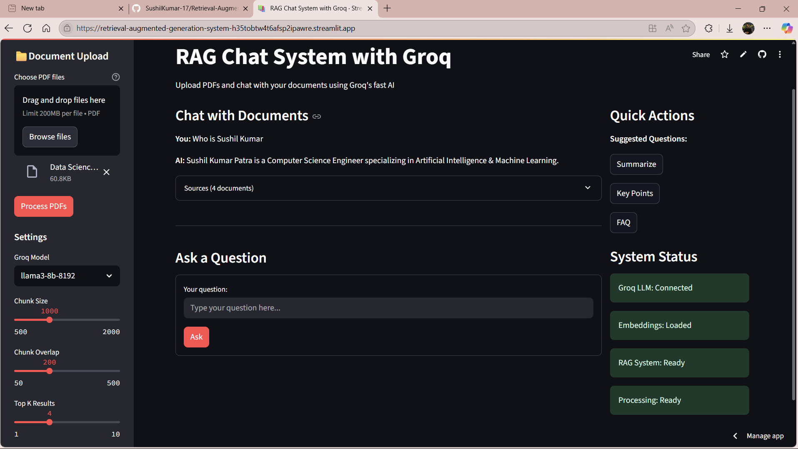

# RAG Chat System with Groq

  
  
  
  
  
  
  
  
  

## Project Overview

A sophisticated Retrieval-Augmented Generation (RAG) chat system that enables users to upload PDF documents and interact with them through natural language queries. The system leverages Groq's high-performance language models for fast inference and provides contextually relevant responses based on document content.

## Deployed Application

**Live Demo:** [RAG Chat System](https://retrieval-augmented-generation-system-h35tobtw4t6afsp2ipawre.streamlit.app/)

  
  
<em>Main chat interface with document upload and query functionality</em>

## Key Features

- **Document Processing**: Upload and process multiple PDF documents simultaneously
- **Intelligent Retrieval**: FAISS-based vector similarity search for relevant context extraction
- **Conversational Memory**: Maintains chat history for contextual conversations
- **Real-time Inference**: Powered by Groq's fast language models (Llama3, Mixtral)
- **Source Attribution**: Displays source documents and page references for transparency
- **Customizable Settings**: Adjustable chunk sizes, overlap parameters, and retrieval configurations

## Architecture

The system implements a multi-stage RAG pipeline:

1. **Document Ingestion**: PDF parsing and text extraction using PyPDFLoader
2. **Text Chunking**: Recursive character-based text splitting with configurable parameters
3. **Vector Embeddings**: Sentence-transformers for semantic text representation
4. **Vector Storage**: FAISS for efficient similarity search and retrieval
5. **Query Processing**: LangChain conversational retrieval chain with memory
6. **Response Generation**: Groq-powered language models for contextual responses

## Technical Implementation

### Core Components

- **Frontend**: Streamlit web application with responsive UI
- **Backend**: LangChain framework for RAG pipeline orchestration
- **Vector Database**: FAISS for high-performance similarity search
- **Language Model**: Groq API integration with multiple model options
- **Embeddings**: HuggingFace sentence-transformers for semantic understanding

### Model Configuration

- **Primary Models**: Llama3-8B, Mixtral-8x7B, Llama3-70B
- **Embedding Model**: all-MiniLM-L6-v2
- **Vector Dimensions**: 384-dimensional embeddings
- **Retrieval Strategy**: Similarity-based top-k document retrieval

## Screenshots

  
  
<em>Main Body</em>

  
  
<em>System status monitoring and configuration options</em>

## Alternative Implementation

### Local Ollama Integration

The repository includes `RAG_ollama_Gemma2b.ipynb`, a Jupyter notebook demonstrating a local RAG implementation using:

- **Ollama Server**: Local model serving infrastructure
- **Gemma2 2B**: Lightweight 2-billion parameter language model
- **Local Processing**: Complete on-device inference without cloud dependencies

This implementation provides:

- Enhanced privacy with local processing
- Reduced latency for offline environments
- Cost-effective solution for resource-constrained deployments

However, due to deployment constraints on cloud platforms, the production application utilizes Groq's cloud-based infrastructure for optimal performance and scalability.

  
  
<em>Real-time chat interaction with source attribution</em>

## Technology Stack

### Language Models

- **Groq API**: High-performance inference engine
- **Llama3**: Meta's advanced language model family
- **Mixtral**: Mistral AI's mixture-of-experts architecture

### Machine Learning Framework

- **LangChain**: Comprehensive framework for LLM applications
- **HuggingFace Transformers**: Pre-trained model ecosystem
- **Sentence Transformers**: Semantic similarity embeddings

### Vector Database

- **FAISS**: Facebook AI Similarity Search for efficient retrieval
- **CPU Optimization**: Optimized for CPU-based inference

### Web Framework

- **Streamlit**: Interactive web application framework
- **Python**: Core programming language

## Configuration Options

### Model Parameters

- Temperature control for response creativity
- Top-k retrieval for context relevance
- Chunk size optimization for document processing
- Overlap parameters for context continuity

## Use Cases

- **Document Analysis**: Research paper analysis and summarization
- **Legal Document Review**: Contract and legal document querying
- **Technical Documentation**: API documentation and manual consultation
- **Educational Content**: Textbook and study material interaction
- **Business Intelligence**: Report analysis and data extraction
